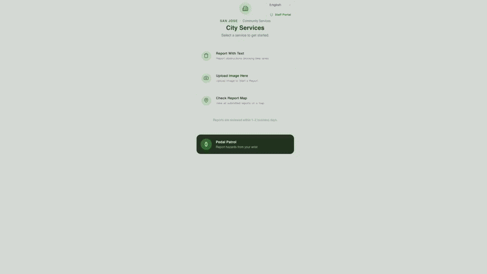

# Lane AI

## Overview

An AI-powered bike-lane safety reporting app that helps San Jose residents report hazards through photos and written descriptions. The app analyzes each submission, identifies the issue, assigns a priority level, and suggests an appropriate city response.

## What Is Lane AI?

**Lane AI**

Our project name combines our mission of improving bike-lane safety with the use of artificial intelligence. **“Lane”** represents the bike lanes the project aims to make safer, while **“AI”** represents the technology used to analyze and organize resident reports.

Lane AI is designed to make hazard reporting more accessible, understandable, and actionable for both residents and city transportation staff.

## Why Lane AI?

Blocked or unsafe bike lanes can force cyclists into vehicle traffic, cause riders to change routes, and create dangerous travel conditions. These hazards may remain unresolved when residents do not know how to report them or face language, accessibility, or technology barriers.

Lane AI offers:

- Photo and text-based bike-lane hazard reporting
- AI-assisted identification of obstructions and safety issues
- Priority-level classification for submitted reports
- Suggested city responses based on the reported hazard
- A simpler reporting workflow for residents
- Better visibility into recurring hazards for city transportation staff

## The Solution

We developed an AI-assisted reporting prototype that helps residents communicate bike-lane safety issues and helps city staff organize incoming reports. It has four main functions:

1. A reporting interface that allows residents to upload a photo and written description of a bike-lane hazard.
2. An AI image-analysis feature that identifies the likely obstruction or safety issue.
3. A prioritization feature that classifies the report and suggests an appropriate city response.
4. A staff-facing workflow that allows city personnel to review the report and determine the next action.

Through AI-assisted analysis and a human-centered design approach, Lane AI aims to reduce barriers to reporting and give the City of San Jose better visibility into unsafe bike-lane conditions. The prototype supports city staff decision-making while keeping people responsible for validating reports and approving real-world actions.

## Responsible AI

We tested the prototype for trust, privacy, and escalation risks using the TRACE red-teaming framework. Testing showed that unclear images could produce overconfident classifications, submitted photos could expose sensitive information, and duplicate reports could create unnecessary alerts.

Recommended safeguards include:

- Uncertainty warnings for low-confidence results
- Human review before action is taken
- Restricted access to sensitive report details
- Masking of addresses, license plates, and identifiable people
- Duplicate-report detection

## Project Context

Lane AI was developed for **BUS 297D: Strategic AI Innovation for Business and Society** at San Jose State University during Spring 2026. The project was completed as a public-sector consulting simulation focused on applying strategic, human-centered, and responsible AI to a civic challenge.

## Disclaimer

Lane AI is an educational prototype and has not been deployed or endorsed by the City of San Jose. Its classifications and recommendations should not be used for real-world safety or enforcement decisions without validation, human oversight, privacy protections, and additional testing.
